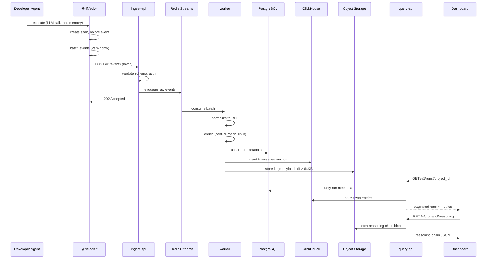
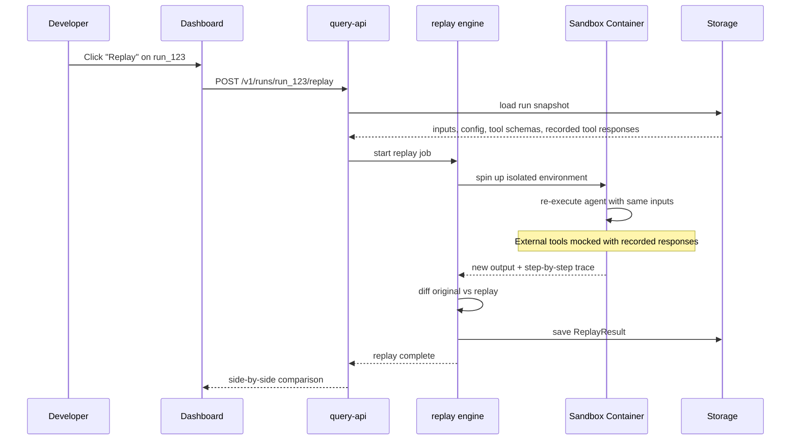
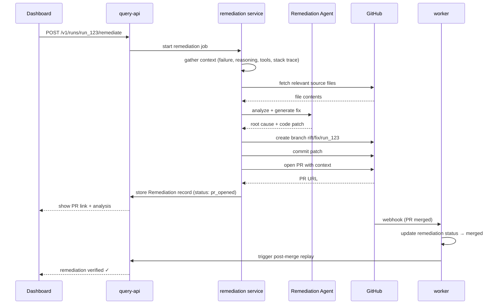

# Data Flow

## 1. Telemetry Ingestion Flow

The primary path: agent executes → SDK captures → platform stores → dashboard displays.



## 2. Failure Detection Flow

Failures are detected in the worker, not the SDK. The SDK reports terminal status; the worker classifies.

```
Run ends with status=error
        │
        ▼
Worker: classify failure
  ├── tool_error      — tool returned error or threw
  ├── llm_error       — model refused, rate limited, malformed output
  ├── timeout         — run exceeded max duration
  ├── validation      — output failed schema validation
  ├── memory_error    — memory store unreachable or empty results
  └── unknown         — unclassified
        │
        ▼
Worker: create Failure record
  ├── Link to run
  ├── Store error fingerprint (for grouping)
  ├── Compute severity (based on frequency + impact)
        │
        ▼
Worker: check alert rules
  ├── If threshold exceeded → webhook / email / dashboard notification
        │
        ▼
Dashboard: Failure appears in inbox
```

## 3. Replay Flow



**Replay modes:**

| Mode | Description | Use Case |
|------|-------------|----------|
| `full` | Re-execute everything including live LLM calls | Non-deterministic debugging |
| `mock_tools` | Live LLM, mocked tool responses | Isolate tool vs LLM issues |
| `mock_all` | Mock LLM + tools with recorded responses | Deterministic verification |
| `step` | Pause after each step for inspection | Interactive debugging |

## 4. Auto-Remediation Flow



## 5. Feedback Loop (Closed Loop)

The full cycle from failure to verified fix:

```
┌──────────┐     ┌──────────┐     ┌──────────┐     ┌──────────┐
│  Agent   │────▶│  Failure │────▶│  Replay  │────▶│  Analyze │
│  Runs    │     │ Detected │     │ Failure  │     │ Root Cause│
└──────────┘     └──────────┘     └──────────┘     └────┬─────┘
                                                         │
┌──────────┐     ┌──────────┐     ┌──────────┐          │
│ Dashboard│◀────│  Verify  │◀────│  GitHub  │◀─────────┘
│ Updated  │     │  Fix     │     │  PR      │    Generate Fix
└──────────┘     └──────────┘     └──────────┘
```

**Dashboard remediation states:**

| State | Meaning |
|-------|---------|
| `pending` | Remediation requested, not started |
| `analyzing` | Remediation agent examining failure |
| `fix_generated` | Code patch ready, PR not yet created |
| `pr_opened` | PR created on GitHub |
| `ci_running` | CI checks in progress |
| `ci_passed` | CI green |
| `ci_failed` | CI red — needs human review |
| `merged` | PR merged |
| `verified` | Post-merge replay succeeded |
| `failed` | Remediation could not produce a fix |

## 6. SDK Event Lifecycle

Within a single agent run, the SDK manages context and spans:

```
rift.startRun({ agent: 'support-bot', input: userMessage })
  │
  ├── span: llm_call (gpt-4o)
  │     ├── event: prompt_sent
  │     ├── event: completion_received
  │     └── event: tool_call_requested (search_docs)
  │
  ├── span: tool_call (search_docs)
  │     ├── event: tool_input
  │     ├── event: tool_output
  │     └── duration: 340ms
  │
  ├── span: memory_read (vector_store)
  │     ├── event: query
  │     ├── event: results (3 chunks)
  │     └── duration: 120ms
  │
  ├── span: llm_call (gpt-4o)  ← second turn
  │     ├── event: prompt_sent (with tool results)
  │     └── event: completion_received
  │
  └── run.end({ status: 'success', output: agentResponse })
        │
        └── SDK flushes all events to ingest-api
```

## 7. Real-Time Dashboard Updates

For the overview dashboard (failure count, active runs, cost burn rate):

```
Worker writes aggregates to ClickHouse
        │
        ▼
Redis pub/sub: project:{id}:metrics
        │
        ▼
Query API SSE endpoint: GET /v1/projects/:id/stream
        │
        ▼
Dashboard subscribes via EventSource
        │
        ▼
UI updates sparklines and counters in real time
```

This is optional for Phase 1 — polling is acceptable initially.
